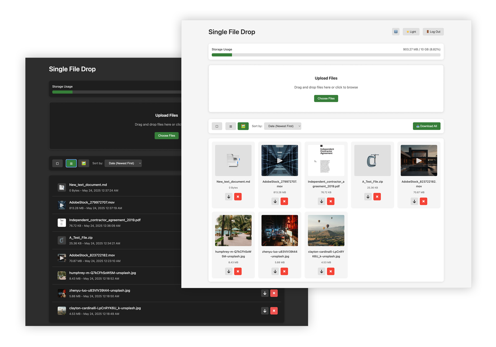

# Single File Drop



Single File Drop is a simple, self-hosted, single-file PHP application for securely uploading, storing, managing, and sharing files. It's designed to be easy to deploy and use, offering a clean interface with essential file management features.

## Main Features

*   **Single File Deployment:** The entire application is contained within `index.php`, making it extremely portable and easy to set up.
*   **Password Protection:** Secure your file drop with a hashed password.
*   **File Uploads:** Drag-and-drop or browse to upload files.
    *   Configurable maximum file size and total storage limits.
    *   Filename sanitization and duplicate handling.
*   **File Management:**
    *   List and icon views for browsing files.
    *   Sort files by name, date, or size.
    *   Delete individual files or selected multiple files (configurable).
    *   Download all files as a ZIP archive.
    *   Download selected files as a ZIP archive.
*   **File Previews:**
    *   Image previews (JPG, PNG, GIF, WEBP, SVG) with lightbox zoom and pan.
    *   Video previews (MP4, WEBM, MOV) using the browser's native player.
    *   Audio previews (MP3, WAV, OGG, M4A) using the browser's native player.
    *   PDF previews: Opens in an embedded viewer on desktop, or a new tab on mobile for better user experience.
    *   Text-based file previews (TXT, MD, JSON, XML, LOG, CSV, HTML, CSS, JS) with basic Markdown rendering.
    *   ZIP file contents preview.
*   **Thumbnail Generation:**
    *   Automatic thumbnail generation for images (JPG, PNG, GIF, WEBP) using GD.
    *   Video thumbnail generation using FFMPEG (if enabled and configured).
    *   PDF thumbnail generation using the Imagick PHP extension (if enabled and configured). This typically requires Ghostscript to be installed on the server.
*   **Security Focused:**
    *   CSRF token protection for all actions.
    *   Rate limiting for uploads and other actions.
    *   Strict file type validation based on extensions and MIME types.
    *   `.htaccess` generation in the `files` directory to prevent direct script execution and directory listing (for Apache servers).
    *   Security headers (X-Content-Type-Options, X-Frame-Options, X-XSS-Protection, Referrer-Policy, Content-Security-Policy).
    *   Path traversal prevention.
    *   Disk space checking before upload.
*   **User Interface:**
    *   Clean, responsive design.
    *   Light and Dark mode theme toggle (syncs with OS preference, with user override).
    *   Storage usage display.
    *   Progress indicators for uploads.
    *   Selection mode for batch operations (delete, download) with icon-based toggle.
    *   Logout button.

## Secure Deployment Guide

Deploying any web application requires careful attention to security. Here's how to securely deploy Single File Drop:

### 0. Server Dependencies (Beyond standard PHP)

*   **PHP GD Extension:** Required for image thumbnail generation.
*   **PHP ZipArchive Extension:** Required for creating ZIP archives (Download All, Download Selected).
*   **PHP Fileinfo Extension:** Recommended for accurate MIME type detection.
*   **(Optional) FFMPEG:** If `$FFMPEG_ENABLED` is `true`, the FFMPEG executable must be installed and accessible at `$FFMPEG_PATH` for video thumbnail generation.
*   **(Optional) Imagick PHP Extension:** If `$PDF_THUMB_ENABLED` is `true`, the Imagick PHP extension is required for PDF thumbnail generation.
*   **(Optional) Ghostscript:** Often required by Imagick to interpret PDF files. Ensure Ghostscript (`gs`) is installed on the server if PDF thumbnails are enabled.

### 1. Web Server Configuration

*   **Use HTTPS:** Always serve the application over HTTPS to encrypt data in transit. Use a free SSL/TLS certificate from Let's Encrypt or your hosting provider's offering.
*   **Permissions:**
    *   The `index.php` file should be readable by the web server user (e.g., `www-data`, `apache`).
    *   The **`files` directory** (and its subdirectory `files/thumbs`) needs to be **writable** by the PHP process/web server user. This is crucial for uploads and thumbnail generation.
        *   Set permissions carefully. For example, `0755` for directories and `0644` for files inside `files` (once created by PHP) is a common starting point. The key is that the *PHP process* needs write access.
        *   The application attempts to create an `.htaccess` file inside the `files` directory to restrict direct execution of PHP files and disable directory listing. Ensure your web server (e.g., Apache) is configured to allow `.htaccess` overrides (`AllowOverride All` or at least `AllowOverride FileInfo Options` for the directory where `index.php` resides, or for the `files` directory specifically).
*   **Disable Directory Listing:** While the app creates `index.html` files in `files` and `files/thumbs` directories to prevent listing, ensure your web server also has directory listing disabled globally as a best practice.
*   **Secure PHP Handler:** Ensure PHP is run through a secure handler like PHP-FPM.

### 2. PHP Configuration (`php.ini`)

*   **`upload_max_filesize` & `post_max_size`:** Configure these in your `php.ini` to match or slightly exceed the `$MAX_FILE_SIZE` set in `index.php`. `post_max_size` should be larger than `upload_max_filesize`.
*   **`max_execution_time` & `max_input_time`:** Set reasonable values for these, especially if handling large file uploads.
*   **Disable Dangerous Functions:** If possible, disable functions that are not needed by the application in `php.ini` via the `disable_functions` directive (e.g., `shell_exec`, `exec`, `system`, `passthru`, `proc_open` if FFMPEG is not used or if you can provide a more restricted path). *Note: If FFMPEG is enabled for video thumbnails, `shell_exec` is used by this script.*
*   **`expose_php = Off`:** Hide the PHP version from HTTP headers.
*   **`display_errors = Off` (for production):** Prevent leaking sensitive information through error messages to users.
*   **`log_errors = On`:** Log errors to a file specified by `error_log`. Ensure this file is not publicly accessible.
*   **`session.cookie_httponly = 1`:** Mitigates XSS by preventing client-side scripts from accessing session cookies.
*   **`session.cookie_secure = 1` (if using HTTPS):** Ensures session cookies are only sent over HTTPS.
*   **`session.use_strict_mode = 1`:** Helps prevent session fixation by ensuring the server only accepts valid, server-generated session IDs.
*   **`session.gc_maxlifetime`:** Set a reasonable session timeout.

### 3. Application Configuration (inside `index.php`)

*   **`$PASSWORD_PROTECTION = true;`**: This is crucial. Ensure it's set to `true`.
*   **`$PASSWORD_HASH`**:
    *   **CRITICAL:** Change the default password hash immediately.
    *   Generate a strong, unique password and hash it using a local PHP script with `password_hash('YourStrongPasswordHere', PASSWORD_DEFAULT)`. (Example: `php -r 'echo password_hash("your_password", PASSWORD_DEFAULT) . PHP_EOL;'`)
    *   Replace the existing `$PASSWORD_HASH` value with this new hash.
*   **`$FILES_DIR` and `$THUMBS_DIR`**: Ensure these directories are:
    *   Writable by the PHP process.
    *   Ideally, located **outside** the webroot if your server configuration allows PHP to access them. If they must be within the webroot, the `.htaccess` file created by the script provides some protection for Apache servers. For Nginx, you'd need to configure similar restrictions directly in the server block.
*   **`$MAX_FILE_SIZE`, `$MAX_TOTAL_UPLOAD_SIZE`, `$MAX_ZIP_SIZE`, `$MAX_ZIP_EXTRACTION_SIZE`**: Configure these limits based on your server resources and needs.
*   **`$ALLOWED_EXTENSIONS` and `$ALLOWED_MIME_TYPES`**: Review and customize these whitelists to only include file types you absolutely need to support. This is a key security measure.
*   **FFMPEG (`$FFMPEG_ENABLED`, `$FFMPEG_PATH`)**:
    *   If enabled, ensure `$FFMPEG_PATH` points to the correct FFMPEG executable.
    *   Be aware that enabling FFMPEG involves `shell_exec`. Ensure the FFMPEG binary is secure and its path is correct. If you don't need video thumbnails, set `$FFMPEG_ENABLED = false;`.
*   **PDF Thumbnails (`$PDF_THUMB_ENABLED`)**:
    *   If enabled, requires the Imagick PHP extension and usually Ghostscript installed on the server for Imagick to process PDFs. Ensure the `$PDF_THUMB_ENABLED` variable is set to `true`.
*   **File Deletion (`$ALLOW_FILE_DELETION`)**:
    *   Set to `true` to allow users to delete files, or `false` to disable this functionality.
*   **Security Headers**: The script sets several security headers. Review these and ensure they align with your security policies. You might need to adjust the `Content-Security-Policy` based on your specific needs or if you integrate external resources (though this script is self-contained).

### 4. Regular Maintenance

*   **Keep PHP Updated:** Regularly update PHP to the latest stable version to get security patches.
*   **Monitor Logs:** Regularly check web server logs and PHP error logs for suspicious activity.
*   **Backup Data:** Regularly back up the `files` directory and the `index.php` file itself.

### 5. Server-Specific Security (Nginx Example)

If you are using Nginx instead of Apache, the `.htaccess` file will not work. You'll need to add equivalent rules to your Nginx server block. For example, to prevent direct access to files in the `files` directory and deny execution of PHP scripts there:

```nginx
server {
    # ... other server config ...
    root /path/to/your/single-file-drop-parent-directory; # e.g., where index.php is located

    location / {
        try_files $uri $uri/ /index.php?$query_string;
    }

    location ~ \.php$ {
        include snippets/fastcgi-php.conf;
        fastcgi_pass unix:/var/run/php/phpX.Y-fpm.sock; # Adjust to your PHP-FPM version
        # Ensure index.php is the only script executed
        # if ($request_uri !~ ^/index\.php) {
        #     return 404; # Or 403
        # }
    }

    # Protect the 'files' directory
    location ~ ^/files/ {
        # Prevent execution of any PHP scripts within 'files'
        location ~* /files/(.*\.php(.\d)*)$ {
            deny all;
        }
        # Optionally, deny direct access to all files if you only want them served via PHP download
        # deny all;
        # Or, if you want to allow direct access for some file types (e.g. images for previews)
        # but still deny listing:
        autoindex off;
        # You might want to allow specific file types to be served directly for previews
        # location ~* ^/files/.+\.(jpg|jpeg|png|gif|webp|mp4|webm|pdf)$ {
        #    try_files $uri =404; # Allow if file exists
        # }
    }

    # Protect the 'files/thumbs' directory similarly
    location ~ ^/files/thumbs/ {
        location ~* /files/thumbs/(.*\.php(.\d)*)$ {
            deny all;
        }
        autoindex off;
        # Allow direct access to thumbnail images
        location ~* ^/files/thumbs/.+\.(jpg|jpeg|png|gif|webp)$ {
           try_files $uri =404;
        }
    }

    # Deny access to .htaccess and other hidden files
    location ~ /\. {
        deny all;
    }
}
```
This Nginx example is illustrative. You'll need to adapt it to your specific setup and security requirements. The key is to prevent PHP execution within your file storage directories and control direct access.

By following these guidelines, you can significantly improve the security of your Single File Drop deployment. 